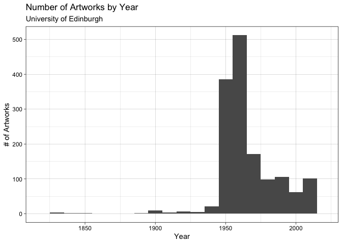

Lab 07 - University of Edinburgh Art Collection
================
Marcus Minko
02-26-2022

### Load packages and data

``` r
library(tidyverse) 
library(skimr)
```

``` r
# Remove eval = FALSE or set it to TRUE once data is ready to be loaded
uoe_art <- read_csv("data/uoe-art.csv")
```

### Exercise 9

``` r
uoe_art <- uoe_art %>%
  separate(title, into = c("title", "date"), sep = "\\(") %>%
  mutate(year = str_remove(date, "\\)") %>% as.numeric()) %>%
  select(title, artist, year, link)
```

    ## Warning: Expected 2 pieces. Additional pieces discarded in 39 rows [149, 194,
    ## 366, 390, 524, 701, 793, 836, 853, 866, 1000, 1063, 1079, 1141, 1321, 1377,
    ## 1382, 1388, 1456, 1642, ...].

    ## Warning: Expected 2 pieces. Missing pieces filled with `NA` in 620 rows [17, 23,
    ## 24, 25, 33, 36, 38, 48, 49, 56, 67, 70, 72, 76, 78, 87, 93, 101, 114, 119, ...].

    ## Warning in str_remove(date, "\\)") %>% as.numeric(): NAs introduced by coercion

### Exercise 10

``` r
skim(uoe_art)
```

|                                                  |         |
|:-------------------------------------------------|:--------|
| Name                                             | uoe_art |
| Number of rows                                   | 2910    |
| Number of columns                                | 4       |
| \_\_\_\_\_\_\_\_\_\_\_\_\_\_\_\_\_\_\_\_\_\_\_   |         |
| Column type frequency:                           |         |
| character                                        | 3       |
| numeric                                          | 1       |
| \_\_\_\_\_\_\_\_\_\_\_\_\_\_\_\_\_\_\_\_\_\_\_\_ |         |
| Group variables                                  | None    |

Data summary

**Variable type: character**

| skim_variable | n_missing | complete_rate | min | max | empty | n_unique | whitespace |
|:--------------|----------:|--------------:|----:|----:|------:|---------:|-----------:|
| title         |         1 |          1.00 |   0 |  86 |     8 |     1343 |          0 |
| artist        |       112 |          0.96 |   2 |  55 |     0 |     1100 |          0 |
| link          |         0 |          1.00 |  49 |  52 |     0 |     2910 |          0 |

**Variable type: numeric**

| skim_variable | n_missing | complete_rate |    mean |  sd |  p0 |  p25 |  p50 |  p75 | p100 | hist  |
|:--------------|----------:|--------------:|--------:|----:|----:|-----:|-----:|-----:|-----:|:------|
| year          |      1369 |          0.53 | 1964.56 |  56 |   2 | 1953 | 1962 | 1980 | 2020 | ▁▁▁▁▇ |

``` r
#1,369 have the year missing

uoe_art %>%
  na.omit() %>% 
  ggplot(aes(x = year)) + 
  geom_histogram(binwidth = 10) + 
  xlim(1818, 2020) +
  theme_linedraw() +
  labs(
        title = "Number of Artworks by Year", 
        subtitle = "University of Edinburgh",
        x = "Year", 
        y = "# of Artworks")
```

    ## Warning: Removed 1 rows containing non-finite values (stat_bin).

    ## Warning: Removed 2 rows containing missing values (geom_bar).

<!-- -->

``` r
#replace the erroneous year 2 with correct 1964

uoe_art <- uoe_art %>% 
  mutate(
        year = replace(year, 
                       year == 2, 1964))

#Which artist has the most art pieces in this collection

uoe_art %>% 
      count(artist, sort = TRUE)
```

    ## # A tibble: 1,101 × 2
    ##    artist               n
    ##    <chr>            <int>
    ##  1 Unknown            349
    ##  2 Emma Gillies       144
    ##  3 <NA>               112
    ##  4 John Bellany        21
    ##  5 Ann F Ward          19
    ##  6 Boris Bućan         16
    ##  7 Gordon Bryce        16
    ##  8 Marjorie Wallace    16
    ##  9 William Gillon      16
    ## 10 Zygmunt Bukowski    16
    ## # … with 1,091 more rows

``` r
#Emma Gillies; my guess is that this artist is local to Edinburgh

#How many titles contain the word "Child" or "child"

uoe_art %>% 
    filter(
          str_detect(
            title, "Child | child")
           )
```

    ## # A tibble: 4 × 4
    ##   title                                       artist               year link    
    ##   <chr>                                       <chr>               <dbl> <chr>   
    ## 1 "Virgin and Child "                         Unknown                NA collect…
    ## 2 "Virgin and Child "                         Unknown                NA collect…
    ## 3 "Woman with Child and Still Life "          Catherine I. McIvor  1938 collect…
    ## 4 "Untitled - Portrait of a Woman and Child " William Gillon         NA collect…

``` r
# 4
```
